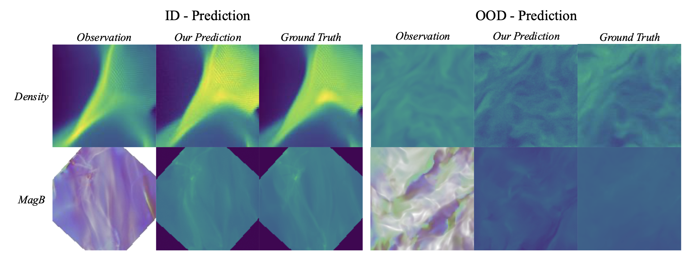
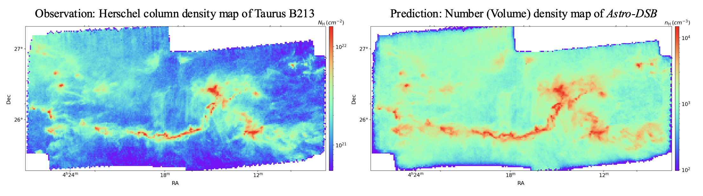

# Astrophysical Diffusion Schrödinger Bridge (Astro-DSB)

Ye Zhu (CS, Princeton & CS, École Polytechniaue), Duo Xu (CITA, University of Toronto), Zhiwei Deng (Google DeepMind), Jonathan C. Tan (Astronomy, UVA&Chalmers), Olga Russakovsky (CS, Princeton)

This is the official Pytorch implementation of the NeurIPS 2025 paper **[Dynamic Diffusion Schrödinger Bridge in Astrophysical Observational Inversions](https://www.arxiv.org/abs/2506.08065)**. 

Below we show the predicted results from our Astro-DSB model on **both synthetic simulations and real observations (the Taurus B213 data)** for volume density and magnetic field strength.

<p align="center">
    

 <p align="center">
    


## 1. Take-away

We introduce *Astro-DSB* tailored for astrophysical observational inverse predictions, featuring a variant of diffusion Schrödinger generative modeling techniques that learns the optimal transport between the observational distribution and the true physical states. 

Implementation note: the current codebase implements a practical paired, endpoint-conditioned diffusion bridge with analytic interpolation and a supervised score target. It should not be interpreted as a general dynamic Schrödinger Bridge solver with explicit KL path minimization or forward-backward consistency optimization.

Our key contributions can be summarized below:

- From the astrophysical perspective, our proposed paired DSB method improves **interpretability, learning efficiency, and prediction performance** over conventional astrostatistical and other machine learning methods.

- From the generative modeling perspective, we show that probabilistic generative modeling yields improvements over discriminative pixel-to-pixel modeling in Out-Of-Distribution (OOD) testing cases of physical simulations **with unseen initial conditions and different dominant physical processes**.

Our study expands research into diffusion models beyond the traditional visual synthesis application and provides evidence of **the models’ learning abilities beyond pure data statistics**, paving a path for future physics-aware generative models that can align dynamics between machine learning and real (astro)physical systems.

## 2. Environment setup

The supported deployment target is a **single-node GPU machine**, including rented Vast AI instances. The default environment file is now GPU-oriented.

GPU training environment:

```bash
conda env create --file requirements.yaml
conda activate astrodsb
python -c "import torch; print(torch.cuda.is_available(), torch.cuda.device_count())"
```

If the final command does not print `True`, do not start training. Install a CUDA-enabled PyTorch build that matches the rented machine instead of a CPU-only build.

Optional CPU/dev environment:

```bash
conda create -n astrodsb-cpu python=3.10
conda activate astrodsb-cpu
pip install torch torchvision --index-url https://download.pytorch.org/whl/cpu
pip install prefetch_generator colored-traceback torch-ema rich tensorboard numpy scipy scikit-learn imageio matplotlib wandb
```

## 3. Dataset preparation

In our work, we train the proposed Astro-DSB model with density and magnetic field data synthesized from the GMC simulations. To work on your customized dataset, you may pro-process the dataset following the format in the ```dataset``` folder.

## 4. Model training and inference

You may use the following commands to train and test the Astro-DSB model, with `expid` to be the specified experiment ID and `N` to be the number of GPUs on the rented machine.

Single-GPU Vast run:

```bash
python train.py --name expid --gpu 0 --n-gpu-per-node 1
```

Single-node multi-GPU Vast run:

```bash
python train.py --name expid --n-gpu-per-node N --master-address localhost --master-port 6020
```

AstroDSB currently supports **single-node** multi-GPU execution only. It does not support general multi-node distributed jobs.

For magnetic-field runs, the observation schema and bridge endpoint are explicit:

```bash
python train.py --name expid_mag --task mag --mag-channel-schema default_xu2025 --mag-bridge-mode projected_b_field
```

Validation / inference:

```bash
python eval.py --name expid --gpu 0
```

Important runtime flags:

- `--task {density,mag}` selects the dataset/task path.
- `--normalization-mode {auto,dataset,strict_unit_interval}` controls dataset normalization policy.
- `--mag-channel-schema` declares the magnetic observation channel ordering.
- `--mag-bridge-mode` selects which declared magnetic observable forms the scalar bridge endpoint.
- `--patch-stride` controls Taurus patch step size. The deprecated `--patch-overlap` flag is still accepted and is interpreted as the same stride value.

Operational note for Vast: checkpoints are written to `results/<name>` and logs to `.log/`. On ephemeral instances, mount persistent storage or copy these directories off the machine before shutting it down.


## 5. Datasets and Model Checkpoints

We provide the pretrained model checkpoints and the astrophysical datasets used in our work to promote open access and facilitate the reproducibility of our scientific contributions.

- Pre-trained Astro-DSB for density prediction: [model checkpoint](https://drive.google.com/file/d/14N0hvJWBKqJBUudpIaZ60Fng_hwH7qj1/view?usp=share_link).

- Pre-trained Astro-DSB for magnetfic field estimation: [model checkpoint](https://drive.google.com/file/d/1bdOCd03v5RslTG4-kE8prr1l6qLVvkjQ/view?usp=share_link).

- Density prediction dataset: [density dataset](https://drive.google.com/file/d/1GSh82Fm84GJbgDKBGjG98AtGNAElN4Dx/view?usp=share_link).

- Magnetic field dataset: [B field dataset](https://drive.google.com/file/d/1tA_GwXEMfva4JjMzwqfP71qfFSuPJqFg/view?usp=share_link).


## 6. Citation and other related works

If you find our work interesting and useful, please consider citing it.
```
@inproceedings{zhu2025dynamic,
  title = {Dynamic Diffusion Schrödinger Bridge in Astrophysical Observational Inversions},
  author = {Zhu, Ye and Xu, Duo and Deng, Zhiwei and Tan, Jonathan and Russakovsky, Olga},
  booktitle = {Conference on Neural Information Processing Systems (NeurIPS)},
  year = {2025},
}
```

If you are more broadly interested in this line of work, there are some relevant projects we have done:

- Duo Xu, Jonathan Tan, Chia-Jung Hsu, and Ye Zhu. Denoising Diffusion Probabilistic Models to Predict the Density of Molecular Clouds, in The Astrophysics Journal (**APJ**), 2023.

- Duo Xu, Jenna Karcheski, Chi-Yan Law, Ye Zhu, Chia-Jung Hsu, and Jonathan Tan. Exploring Magnetic Fields in Molecular Clouds through Denoising Diffusion Probabilistic Models, in The Astrophysics Journal (**APJ**), 2025. 


### Acknowledgements

We would like to thank the authors of previous related projects for generously sharing their code, especially the [IS2B](https://github.com/NVlabs/I2SB), from which our code is adapted.
